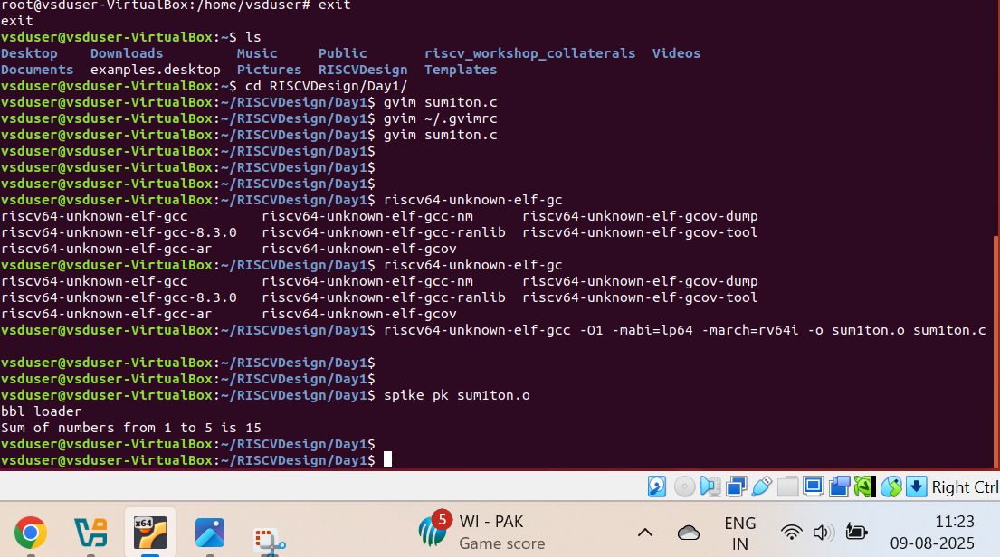
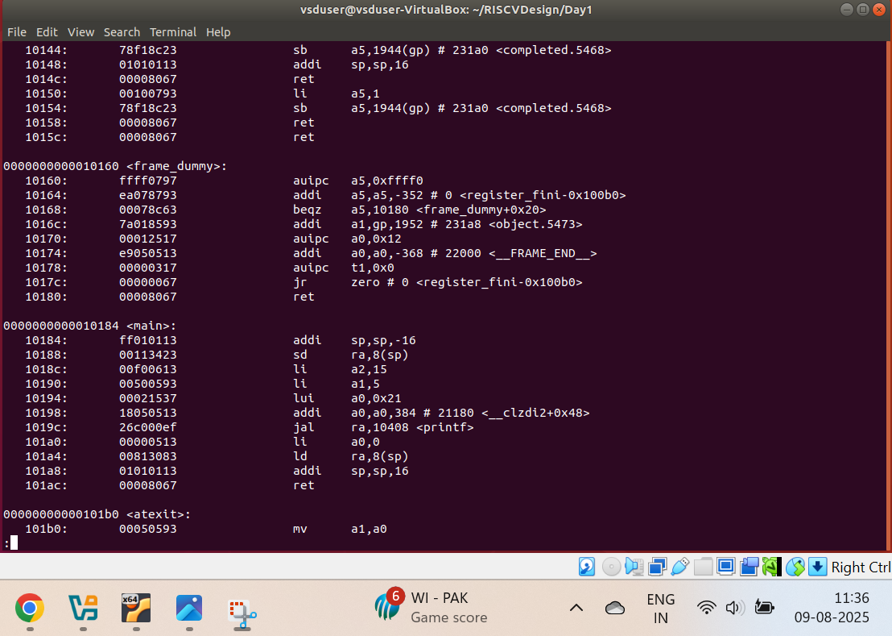
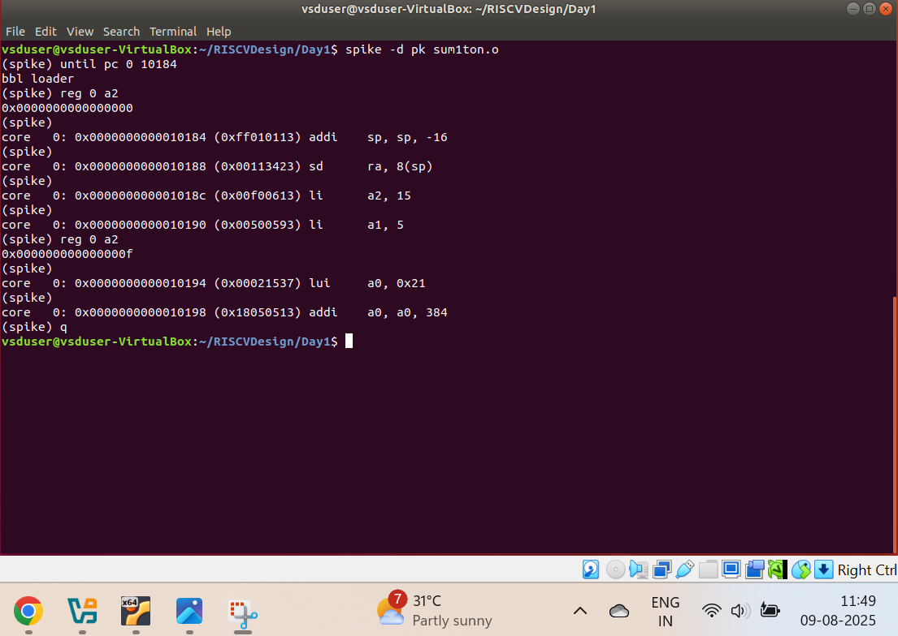
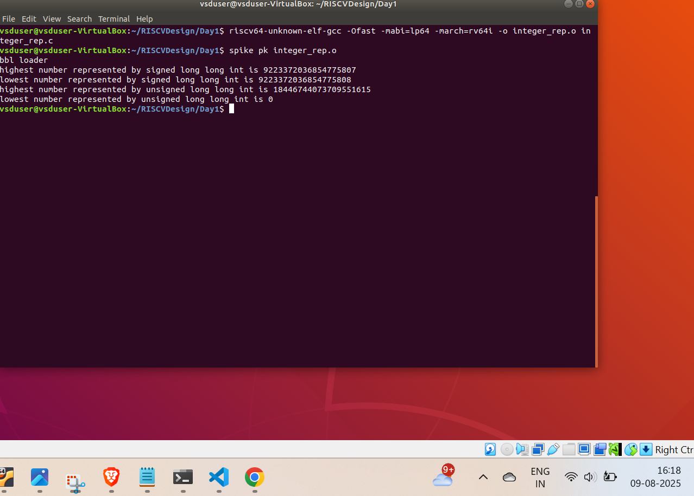

# Day 1: Introduction to RISC-V ISA and GNU Compiler Toolchain

## Key Concepts Covered

### Instruction Set Architecture (ISA)
- Any program written in a high level language gets converted to assembly and then to binary. An Instruction Set Architecture (ISA) provides an understanding on how the hardware converts to assembly and intreprets the binary code that is generated.
- RISC-V is an open-source ISA known for its smaller and simple instructions which helps in developing hardware that is not much complex and simpler to understand.

### RISC-V Tools Used
- **RISC-V GNU Compiler (riscv64-unknown-elf-gcc)**: Compiles C code for RISC-V architecture
- **Spike Simulator**: RISC-V ISA simulator
- **Object Dump Tool**: Displays contents of object files

### 4. Basic Commands
```bash
# Compile C program for RISC-V
riscv64-unknown-elf-gcc -O1 -mabi=lp64 -march=rv64i -o <output_file> <input_file.c>

# View assembly code
riscv64-unknown-elf-objdump -d <output_file>

# Run program in Spike simulator
spike pk <output_file>
```

### Integer Number Representation
- **Unsigned Numbers**: Range 0 to 2^n-1 (For n=4 bits, range is 0 to 15, represents only positive numbers including zero)
- **Signed Numbers**: Range -2^(n-1) to 2^(n-1)-1 (For n=4 bits, range is -8 to +7, uses most significant bit as sign bit)
- Two's Complement representation for negative numbers: Invert all bits and add 1 to represent negative numbers

- Example:

| Binary | Decimal |                                              |
| ------ | ------- | -------------------------------------------- |
| 0101   | +5      |                                              |
| 1011   | −5      | (invert `1011` → `0100`, add 1 → `0101` = 5) |


## Lab Work
### Compiling a basic sum program using RISCV GCC

### Converting the object file to assembly using objdump command

### Debugging the object file using spike


### Signed and Unsigned Integer Representation


## Tools Setup
- RISC-V GNU Toolchain
- Spike Simulator
- GTKWave for waveform visualization

## Key Takeaways
1. Understanding the role of ISA in computer architecture
2. Familiarity with RISC-V toolchain
3. Basic program compilation and simulation workflow
4. Introduction to number systems and representation