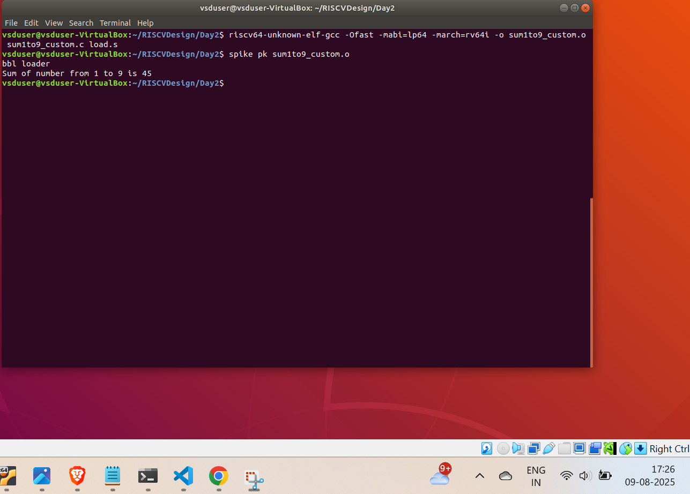

# Day 2: Application Binary Interface (ABI)

## Interface Hierarchy in Computer Systems

### Different Types of Interfaces
1. **User Level**: Appearance and Functionality (UI/UX)
2. **Software Level**:
   - Application to Program → API (Application Programming Interface)
   - Program to OS → ABI (Application Binary Interface)
3. **Hardware Level**:
   - OS to Hardware Architecture → ISA (Instruction Set Architecture)
   - Architecture to Hardware → RTL (Register Transfer Level)

### Application Binary Interface (ABI)
- Serves as the bridge between application programs and hardware through system calls
- Defines how applications interact with the hardware at a low level
- Critical for software-hardware communication

### RISC-V Register Details
- Total of 32 registers in RISC-V architecture
- Why 32 registers?
  - Instruction format constraints:
    - 7 bits reserved for opcode
    - 5 bits for source/destination registers
    - Common across R, I, S type instructions
  - 2^5 = 32 possible register combinations

### Memory and Addressing
- RISC-V implements little-endian addressing system
- Each register has a standardized ABI name for consistent access
- ABI names help in programming and debugging

## Lab Work
### ABI Function Call Demonstration

## Key Concepts
1. Understanding interface layers in computer systems
2. Role of ABI in system architecture
3. RISC-V register organization
4. Memory addressing conventions